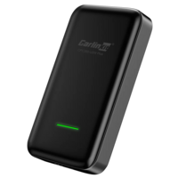

# Adventures in Apple CarPlay

This repo is a log of my experience hacking around with a Carlinkit CPC200-U2W Plus (2.0) trying to get it to work in iOS lockdown mode. There is unlikely to be much active code or work here, I just wanted to share what I learned in case it helps others with this (now aging) device.

## Background
In the fall of 2020, I purchased an adapter to enable wireless CarPlay capabilities on the the infotaiment center in my car that only supported wired CarPlay. It was model CPC200-U2W Plus from Carlinkit (also sold under other names such as "Carplay2Air"):



This device served me well for a long time, but I was often frustrated with 3 things:
* The CarPlay interface was sluggish to input
* There was a second or two delay between playing a song and hearing the audio
* I'd often have to unplug and replug the device to get it to be recognized after starting my vehicle

I didn't bother resolving these features as I could tolerate the nuisance and I was not worth it to me to purchase another adapter. Having had experience with automotive, and chineese-brand devices in the past, I felt lucky it worked at all given the inconsistent implementation of standards and interfaces. Trying other devices, may not make any difference, and at the time there were not many to choose from.

## Current Day 2024

Fast forward a few years, I recently discovered and placed my iOS device into [lockdown mode](https://support.apple.com/en-us/105120) for additional security. While the Apple oddly tries to dissuade people away from using this feature with phrasing like "extreme" and "most sophisticated digital threats", this feature is actually a really good idea. It disables accepting random attachments, connecting to insecure wifi, and other good security practices.

Quite the opposite of Apple's guidance, I think there is little reason *not* to use this feature. I've rarely had problems with the added security, and what problems I've encountered are only nuisances really and have ways to work around them.

Except for the Carlinkit CPC200-U2W Plus...

## Insecure WPA

The vehicle in wich I had installed the CPC200-U2W Plus was not a vehicle I drove daily. Therefore, I did not immediately realize that CarPlay had stopped working, and that the some automations I had on my phone to mute volume and stop playing audio when bluetooth was disconnected, was the result of an issue with lockdown mode and this device.

I eventually got tired of the notifications of connecting/disconnecting and discovered that if I manually connected to the wifi of the CPC200-U2W Plus, CarPlay would work just fine.

As I discovered, CarPlay is a combination of bluetooth and Wifi association and handshaking. While discovering a CarPlay device is performed over bluetooth, Wifi is used for some (all) of the data transfers. This make sense, as the UI is being rendered on the phone and sent to the display unit, and that takes a lot of bandwidth.

Upon manually connecting to my CPC200-U2W Plus wifi, I was presented an error of the likes "WPA TKIP is insecure in lockdown mode" (I don't think that was the exact error, but close).

One might get frustrated with iOS lockdown mode over this inconvenience and disable lockdown - but this is actually a good thing! WPA and TKIP are very insecure, and this could expose all sorts of data to eavesdroppers. The better option would be to instead enable a more secure protocol.

## Misery Loves Company

I thought, that perhaps I could simply update the firmware on the device and perhaps a more secure implementation of wifi would be used... Boy was I wrong about that, as I will explain.

But first, I wanted to check if there was a simple fix that could be made in my phone's settings. I found a [discussion on Reddit](https://www.reddit.com/r/ios/comments/16nfdix/ios_17_lockdown_mode_blocking_carplay/) where others had encountered the same issue and confirmed that lockdown mode was indeed blocking CarPlay.

However, a poster noted that Carlinkit 5.0 (I later discovered mine was 2.0) did work in lockdown mode. This gave me insight that indeed it was possible to use in lockdown mode, we just need to get the wifi to use a more secure protocol.

## The Rabbit Hole

This is where things started to become more involved than I had initially planned:
* First, the over-the-air (OTA) updates for my unit did not work. The procedure involves connecting to the wifi of the unit, then clicking update on a webpage at `192.168.50.2`. However, this did not work for me because it could not share traffing with my celluar (perhaps again due to lockdown mode)
* Not a problem I thought, because I had read online at the Carlinkit site that the firmware could be manually updated with a USB drive - except you had to email them for it, which I thought was silly. Turns out, they had that proceedure because their update process is not very robust.
* Looking to see if I could just get the firmware elsewhere, I stumbled across [ludwig-v/wireless-carplay-dongle-reverse-engineering](https://github.com/ludwig-v/wireless-carplay-dongle-reverse-engineering) repository where for the past couple of years some work was going on reverse engineer the firmware and collect various updates.

So this was looking promising I thought. After reading a few other threads, discussion posts in the repo, and elsehwere, I saw that version `2021.03.06.1343` seemed to be working for people. But I was still a bit confused as to which variant to install, and which one I had. There were descriptions of blue UIs, red UIs, AUTOKIT, and all sort of things that were not well documented in the repo or discussions.

I eventually decided to take my device apart, because someone (erronously) said that devices based on AT91SAM9260 were very old and slow. Sure enough, my device did have a AT91SAM9260, but it turned out that is just a fake name. The CPU is actually a NXP/Freescale i.MX 6UltraLite, which I later confirmed myself once I had root access. This was very surprising to me, as I've seen fake chips before, but one ones with such misleading identifiers.

I figured out I had a U2W V2 based on photos shared from others in the discussion threads. This made it simple to idenfiy which firmwares/inages I should used - they are all named `U2W_Update.img` for my device.

## The First Try (Never Succeeds)

Feeling I had now had clarity on the image I shoudl used, I decided to move forward with my attempt to update the device. I used `2021.03.06.1343` because as mentioned others seemed to have success with it, but also because the author of that repo had made some custom images that enabled "performance mode", ssh access, and other capabilities. Those sounded neat.

So I updated my device with the stock image first, then the custom firmware. I plugged in the device to my car and it was recongnized... but, the wifi was still insecure. Though, this was a minor win at this point, because the CarPlay interface became much faster! And the admin screen at `192.168.50.2` offered some new features, such as adjusting the audio delay (buffer time really).

## Oops

Dissappointed that the wifi was still using WPA/TKIP and lockdown mode on iOS would not automatically connect to it, I figured I might as well try the latest version of the stock firmware shared in the repo, `2022.12.14.1100`. Reading around, it appeared rolling back was possible (which upon experience, not fully), and so there was not much risk to trying it to just see if they ever added a more secure wifi.

I wish now, that future me had suddenly emerged from a portal at my workbench and slapped me in the face telling me to stop what I was doing. Had future me told me to think a little bit harder about the progress I had alrady made before taking a more drastic approach, I could have saved myself nearly a day of tring to get my device back to working order.

But future me is never around when I need him. Lazy.

So, it turned out this was a bad idea. While I could still access the admin screen (and even more interesting config options were now present), upon connecting the device to my car, the red light would just stay solid (it used to blink when searching) and the car's infotainment unit no longer recognized the device as a carplay unit.

After many, many hourse of plugging/unplugging, changing settings, downgrading firmwares, etc. I found myself back on the custom `2021.03.06.1343` firmware no probem, but the car still would not recognize the device.

## What I Wish I Had Done

Now that I had the device on ludwig-v's custom `2021.03.06.1343`, I decided to look closer at the scripts provided in the repo. It turns out, the author created a package for dropbear SSH, enabling logging in the device and poking around.

See, at first, I didn't realize this was running an embedded linux computer. Upon seeing AT91SAM9260, I had it in my head this was a simpler microcontroller (not microprocessor) because I have only worked with SAMD devices before, and I thought the SAM identifer was a microcontroller. Furthermore, I was not familiar with the i.MX 6UltraLite, and didn't understand that was a microprocessor - though "Freescale" shoudl have tipped me off, because I did recognize that name.

Being able to login to SSH to the device, opened up a much better understanding for me as I am quite familiar with Linux. I also discovered, that in ludwig-v's repo, there are a number of extracted images that had the filesystem contents. This made it quite easy for me to read through the init.d and scripts to figure out how the device worked and that ultimately, discover that `hostapd` was being used.

Thanks to my OpenWRT hacking days `hostapd` jumped out at me, and I discovered that the `hostapd.conf` (not directly present in the extracted images, it's in the `rtl8822_rootfs.tar.gz` if your device has that wifi chip) was configured to use insecure WPA/TKIP:

(Before)
```conf
# WPA and WPA2 configuration

macaddr_acl=0
auth_algs=3
ignore_broadcast_ssid=0
wpa=3
wpa_passphrase=12345678
wpa_key_mgmt=WPA-PSK
wpa_pairwise=TKIP
rsn_pairwise=CCMP
```

That's an easy fix! Simply change `wpa=2`, and for good measure `wpa_pairwise=CCMP`

These two changes enables only WPA2, and uses AES (CCMP) instead of TKIP. Through trial and error, I did find that iOS/lockdown must have only WPA2 enabled, leaving option 3 allows both WPA/WPA2 and lockdown sees that as insecure.

## The Flash

While I managed to fix the lockdown insecure Wifi issue, unfortunatley my device was still not recognized. One may think downgrading the device image would restore it to the same state that was working for me previously. But as I found out, the image update files seem to be cumulative.

In order to figure out what was happenign, I manually stepped through the firmware update script that runs on USB hotplug. I learned, that all it is really doing is taking the `.img` file (which is really a tar.gz file) and then copying files over top of the filesystem. This explained well why moving between versions did not fully revert the device.

It became clear, that something in the later image update versions made a change that was not reverted by the earlier versions. At this point - I wish I had taken the time to dump the flash from my device as that would have fully restored all the files in the filesystem.

Hindight, am I right? (Gesturing to the crowd)

Fortunately, other members had shared their flash images, and upon reading the discussion it seemed one in [particular by bronken](https://github.com/ludwig-v/wireless-carplay-dongle-reverse-engineering/blob/master/Flash_Dump/MX25L12835F_FW_20210306.bin) was version `2021.03.06.1343` the version I wanted to go back to. So, I grabbed a CH341a programmer I had lying around (doesn't everyone?) some micrograbbers and leads and went to work.

## Restoring the Device

Wiring up the device was the easy part. It is an SPI flash from Macronix and the [MX25L12835F datasheet](https://www.macronix.com/Lists/Datasheet/Attachments/8653/MX25L12835F,%203V,%20128Mb,%20v1.6.pdf) is available online. Connecting to the CH341a was as simple as connecting VCC, GND, MOSI/MISO, and CS.

Then future me appeared for once (actually before this step). While snooping around the filesystem, I came across a file named `/etc/uuid_sign`. That seemed kind of important, given I was reading posts about people having issues with activation. At somepoint, (4 years ago now) I must have successfully activated my device because before I went messing around with the device, it was working.

Thinking this file seemed important, I saved this file over ssh by spitting it out as base64 (scp copy may have worked, but I didn't try it)

```bash
cat uuid_sign | base64
```

It's a good thing I saved this, because indeed, I would need it.

Back to flashing... This was easy, once I figure out how to get the flash chip into a state that could be recognized by `flashrom` in Linux. I really did not want to desolver the chip, and I read that for some people it worked fine. Others said they needed to short out the CPU's oscilator, but I didn't want to do that either.

Upon initially having failure getting `flashrom` to see the chip over SPI, I had the idea of holding the reset pin of the `MX25L12835F` low (reset enabled) while connecting the programmer to see what happened. It turns out, if it is held long enough (5-10s) then the CPU seems to give up thinking that there is no EEPROM on the SPI bus, and probably enters a halt state and no longer interfers ont he SPI bus. This was pretty easy then to get the `flashrom` to see the chip:

```bash
sudo apt install flashrom
sudo flashrom -p ch341a_spi -c MX25L12835F/MX25L12845E/MX25L12865E -V
```

I could then dump my existing flash (which I did this initally):
```bash
sudo flashrom -p ch341a_spi -c MX25L12835F/MX25L12845E/MX25L12865E -r MX25L12835F_CFW.bin -VVV
```

And then write the restore flash:
```bash
wget https://github.com/ludwig-v/wireless-carplay-dongle-reverse-engineering/raw/master/Flash_Dump/MX25L12835F_FW_20210306.bin -O MX25L12835F_FW_20210306.bronken.bin

sudo flashrom -pch341a_spi -c MX25L12835F/MX25L12845E/MX25L12865E -w MX25L12835F_FW_20210306.bronken.bin -VVV
```

Note: On Ubuntu jammy, version 1.2 of `flashrom` is what is in the repos. I think 1.3 has a new `--progress` feature (it's in the man page), but I want to stay on an LTS release. The simple solution is to use the `-VVV` flag to see that something is happeneing, but I do think it slows down the already very slow read/write operations form the CH341a.

## The Road to Glory
Having restored the flash, I wanted to get back to the custom firmware so I could access the device with SSH and change the `hostapd.conf` again. I thought I could just update using the `2021.03.06_BASED`, but this seemed to fail as the LED flashing was too short-lived compared to other updates. I didn't even check, and decided to install the stock `2020.11.10.2138_ROLLBACK` as someone said that could fix activation issues, which I expetcted to have, then installed all the subsequent custom firmwares in order until I was back on `2021.03.06.1343`

I then launched SSH, updated `hostapd.conf` and went to test the device. The good news: It was recognized by the car! This means I reverted whatever change those laster firmwares did that caused it to no longer be recongized. The bad news: it wanted activation.

But I saved the `/etc/uuid_sign` - could I just update it to the old one and be good. Upon looking at the MD5 hashes, it was different contents than what I had. Therefore, I updated it with my file, tried again with the car, and wonderfully CarPlay worked without the activation screen. And icing on the cake (rather the whole poitn of this exercise) my changes to enable WPA2/CCMP for the `hostapd.conf` indeed made lockdown mode happy!

I'm glossing over the fact that I removed the old recognized CarPlay devices in the vehicle, and in the admin screen of the CPC200-U2W Plus, but upon re-pairing the devices, CarPlay would now connect automatically even though my iOS device was in lockdown mode.

## Conclusion
Success! I saved $80 or so by spendig over a day hacking a device.

While the economics are not quite justified, I am glad I spend the time to get this device working for the following reasons:
* We are far too disposable in our mindset as a society. It probably cost me more than $80 worth of my time compared to ordering a Carlinkit V5 from Amazon, but by giving my device a second life, I kept waste out of the landfill and reduced my carbon footprint from having planes and trucks deliver me a new device.
* I learned a lot. I've been workign with embedded devices for some time, but never saw an implementation quite like this. It also has made me more confortable taking on repairs/mods of other devices before throwing them in the landfill in the future.

In closing, if you have one of these devices and it's not working with iOS lockdown mode, it just needs a little love to enable more secure Wifi protocols.